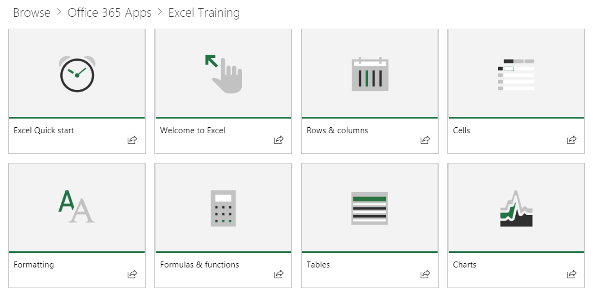
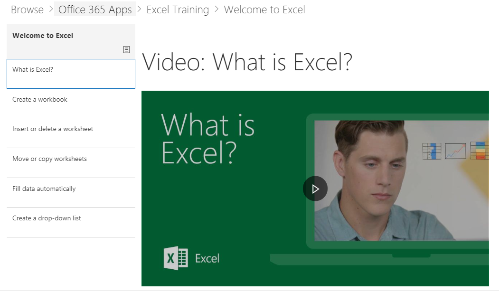

# Webpart default content

## The Playlist Model

Our webpart uses a familiar playlist model to organize the content.  This model is simple for your end users to understand and for you to customize should you choose to.  Customization is not required.  Our out of the box experience provides you with effective training content based on our extensive research.

These playlists are designed to help organizations tailor the learning experience for users and present them with easy-to-consume playlists to teach them new, and more productive behaviors. The serve content from Support.Office.com, and the assets are short and sweet, with peppy, engaging videos. 

Each tile represents either an individual featured playlist or a content category. Clicking on any playlist or category tile quickly navigates the user into the selected area. The graphic below shows both featured lists under "Get Started Playlist" and Office 365 App categories like Excel, Microsoft Teams and others. 

Clicking the Excel category for instance navigates them to a collection of playlists.  They can watch content in order or select what interests them based on their learning needs. 

Selected playlist view

## Next Steps

- Browse and familiarize yourself with the existing content
- Proceed to [customize playlists](customplaylists.md)
